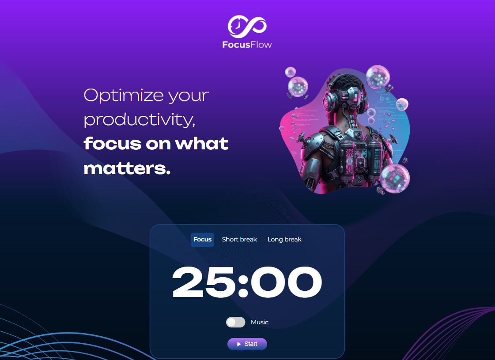
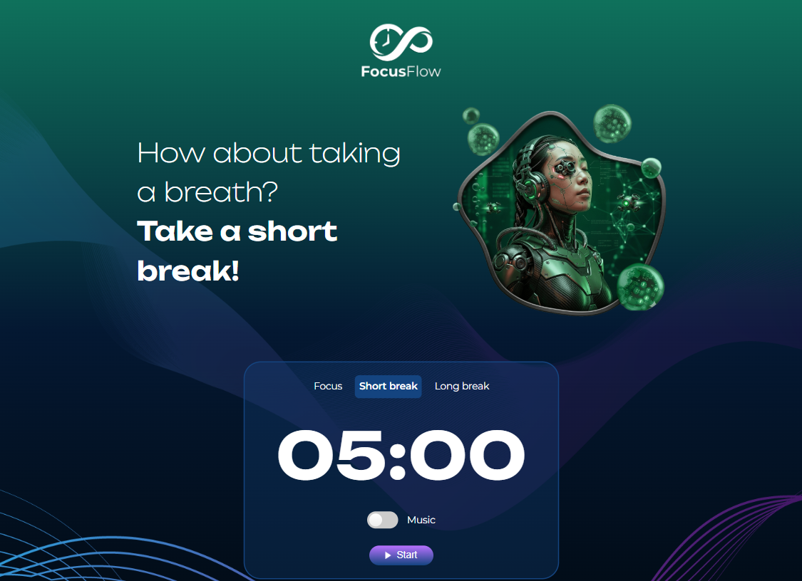
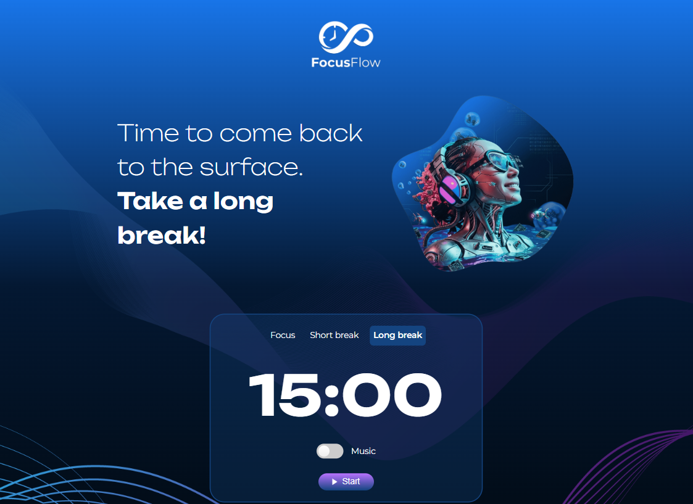

<h1 align="center"> 🍅 FocusFlow - Pomodoro Timer</h1>
A simple and interactive Pomodoro Timer built with HTML, CSS, and JavaScript to help improve focus and productivity using the Pomodoro Technique.
 

  
  
  

📌 About the Project 
FocusFlow is a web application designed to manage work sessions and breaks efficiently. It alternates between focused work periods and rest intervals, helping users stay productive without burnout.

This project was created to practice: 
DOM manipulation
JavaScript time-based logic
Clean and scalable project structure

🚀 Features 
⏱ Start, pause, and reset timer 
🍅 Focus mode (25 minutes) 
☕ Short break (5 minutes) 
🌙 Long break (15 minutes) 
🔄 Dynamic interface updates 
🔊 Optional sound notification 
📱 Responsive design 
